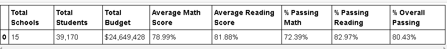
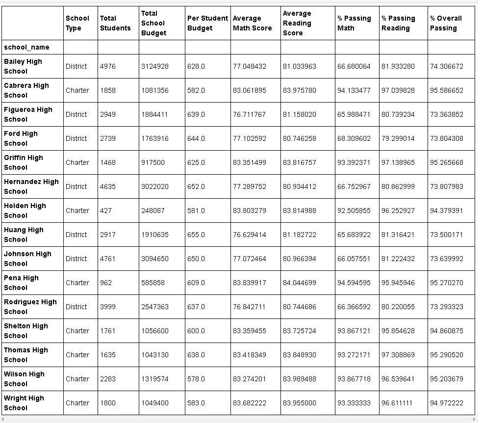
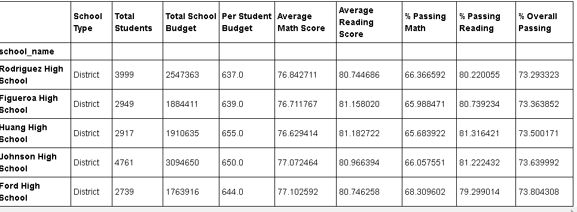
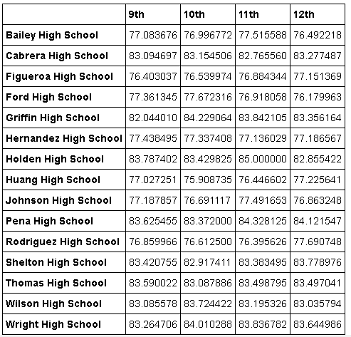
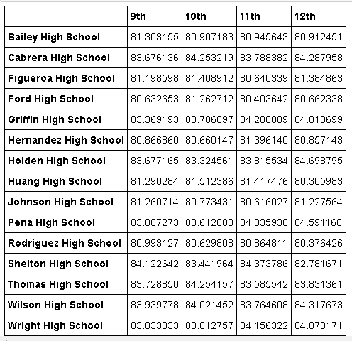
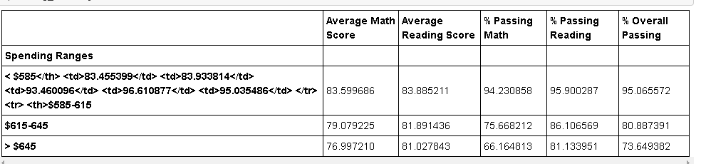
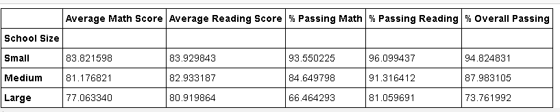
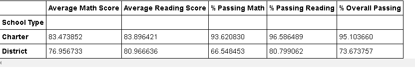

# Pandas Homework 

## Option 2: PyCitySchools

The task was to analyze the district-wide standardized test results, aggregate the data to and showcase obvious trends in school performance using pandas. 

### District Summary

* Created a high level snapshot (in table form) of the district's key metrics, including:
  * Total Schools
  * Total Students
  * Total Budget
  * Average Math Score
  * Average Reading Score
  * % Passing Math (The percentage of students that passed math.)
  * % Passing Reading (The percentage of students that passed reading.)
  * % Overall Passing (The percentage of students that passed math **and** reading.)

 

### School Summary

* Created an overview table that summarizes key metrics about each school, including:
  * School Name
  * School Type
  * Total Students
  * Total School Budget
  * Per Student Budget
  * Average Math Score
  * Average Reading Score
  * % Passing Math (The percentage of students that passed math.)
  * % Passing Reading (The percentage of students that passed reading.)
  * % Overall Passing (The percentage of students that passed math **and** reading.)

   

### Top Performing Schools (By % Overall Passing)

* Created a table that highlights the top 5 performing schools based on % Overall Passing. Include:
  * School Name
  * School Type
  * Total Students
  * Total School Budget
  * Per Student Budget
  * Average Math Score
  * Average Reading Score
  * % Passing Math (The percentage of students that passed math.)
  * % Passing Reading (The percentage of students that passed reading.)
  * % Overall Passing (The percentage of students that passed math **and** reading.)

   

### Bottom Performing Schools (By % Overall Passing)

* Created a table that highlights the bottom 5 performing schools based on % Overall Passing. Include all of the same metrics as above.

 

### Math Scores by Grade

* Created a table that lists the average Math Score for students of each grade level (9th, 10th, 11th, 12th) at each school.

 

### Reading Scores by Grade

* Created a table that lists the average Reading Score for students of each grade level (9th, 10th, 11th, 12th) at each school.

 

### Scores by School Spending

* Created a table that breaks down school performances based on average Spending Ranges (Per Student) using bins to group school spending. Include:
  * Average Math Score
  * Average Reading Score
  * % Passing Math (The percentage of students that passed math.)
  * % Passing Reading (The percentage of students that passed reading.)
  * % Overall Passing (The percentage of students that passed math **and** reading.)

   

### Scores by School Size

* Created a table that breaks down school performances using reasonable bins for approximation of school size (Small, Medium, Large). Include:
  * Average Math Score
  * Average Reading Score
  * % Passing Math (The percentage of students that passed math.)
  * % Passing Reading (The percentage of students that passed reading.)
  * % Overall Passing (The percentage of students that passed math **and** reading.

### Scores by School Type

* Repeated the above breakdown, but this time grouped schools based on school type (Charter vs. District).

 

## Observable Trends Based on the Data

* According to data analysis, all top performing schools based on Overall Passing were Charter schools and in comparison, District schools were underperforming as evident in the table for bottom performing schools. Overall Passing rate for Charter schools was above 95% compared to about 73% for District schools.

* Based on school size, smaller sized schools have higher success rates. Larger schools have lower passing. Interestingly, in terms of spending per student, the schools that spend the least had higher performance rates.

* Across the board student achieved higher reading scores than math scores.
